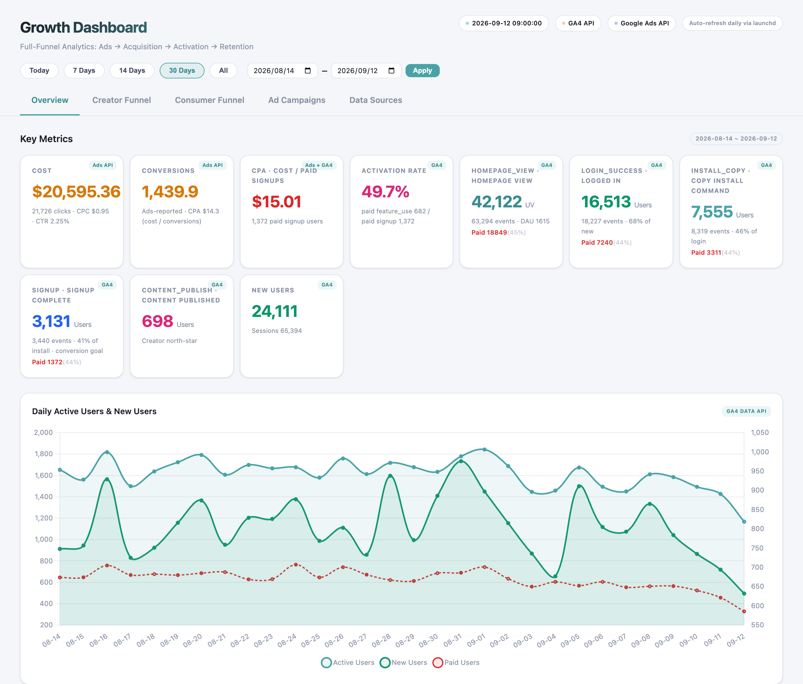
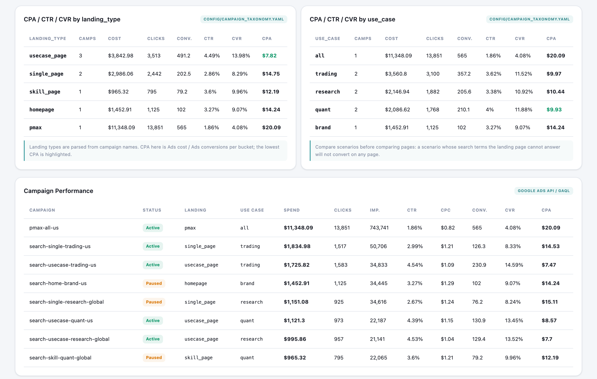
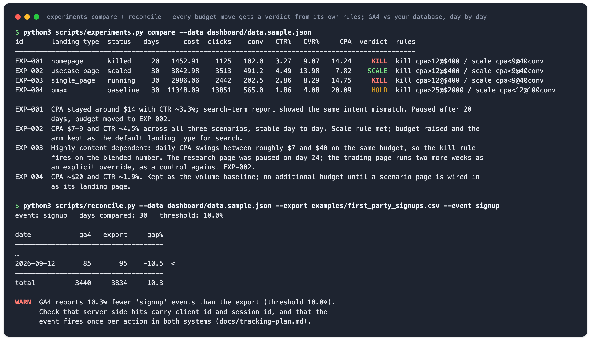

# GA4 + Google Ads 看板

[English](README.md)

这是一个给**用 Google Ads 拉新的小团队**用的投放看板和决策记录。

**适用场景。** 你的产品有「注册 → 激活 → 关键动作」这样的漏斗，你在投 Google Ads，可能还配了代理或投手。常见的两种浪费是：钱花了不知道用户去了哪里；广告算法拿错误的转化目标在学习。这个仓库把投放前的埋点计划、每天从 GA4 和 Google Ads 拉数合并、按承接页类型拆看成本和转化、和自有数据库对账、每次预算决定记成一条实验，串成一条闭环。

**给谁用。** 创始人、增长负责人、产品市场人员：想让每周和代理的复盘讨论的是双方都能复现的数字。一台装了 Python 3.9 的笔记本就能跑，不需要数据库。

**它给你什么。** 一个静态看板页（花费、转化、两种口径的 CPA、激活率、两条漏斗），按承接页类型和使用场景拆开的成本与转化，GA4 与自有数据库的逐日对账（缺口超阈值就报警），以及一份实验记录：每个预算决定都给出 KILL / SCALE / HOLD 判定。离线演示只要 Python 3.9 和标准库，接真实数据才需要 Google 的 SDK。

**范围和边界。** 只做 Google Ads + GA4，不做 Meta / TikTok 投放；示例数据合成，事件名、场景维度、实验记录都是配置，结构可直接迁到自己的产品。

## 效果预览

下面全部在合成样例上离线跑出（30 天、8 个 campaign、两条漏斗）。数字只用来说明口径，不代表任何真实账户。

**看板。** 花费、转化、两种口径的 CPA（Ads 上报的，和 GA4 里看到的每个付费注册的成本）、激活率、每个漏斗事件及其付费占比、日活对付费用户。



**按承接页类型和使用场景拆看成本与转化**，两个维度都从 campaign 命名解析出来，旁边是 campaign 明细表。样例里场景聚合页每个转化约 8 美元，Performance Max 约 20 美元，整个仓库就是围绕这组对比搭起来的。



**周复盘背后的两条命令行检查：** 实验记录与实际指标联表，按每条记录自己的规则给出 KILL / SCALE / HOLD；GA4 与你自己的注册导出逐日对账。样例刻意复现了那个 10% 的缺口，它意味着后端上报缺了会话参数。



## 和 GA4 自带报表不一样的五点

GA4 和 Google Ads 后台各有报表，Looker Studio 也能把它们拼在一起。这个仓库多做的是决策层面的五件事：

1. **承接页类型是一等维度。** 从 campaign 命名规则解析出「首页 / 技能页 / 场景聚合页 / 单内容页 / PMax」和使用场景，成本和转化按这两个维度拆看，而不是只看账户总数。
2. **GA4 和自有数据库对账。** 逐日比较同一转化事件在 GA4 和你数据库里的数量，缺口超过阈值就报警。持续为负的缺口是后端上报缺会话参数的典型症状，广告算法因此「没有学习对象」。
3. **每个预算决定是一条带规则的实验记录。** 假设、承接页类型、日预算、转化事件、关停规则、放量规则、结论，脚本把记录和实际指标联表，给出今天该 KILL、SCALE 还是 HOLD。
4. **转化目标按「上一步转化率约 50%」选。** 太浅的事件（页面浏览）没有业务意义，太深的事件（发布）太稀疏训练不动；仓库把这条规则写进配置和文档。
5. **先埋点再投放，全静态无数据库。** 埋点计划是机器可读的配置，拉数时对不在计划里的事件报警；每天的数据合并成一个 JSON，页面直接渲染，一台笔记本就能跑。

## 快速开始

下面所有命令都离线跑在仓库自带的合成数据 `dashboard/data.sample.json` 上。Python 3.9 或更高，只用标准库（装了 PyYAML 就用 PyYAML，没装则由内置的读取器解析配置文件）。

```bash
git clone <本仓库> && cd ga4-ads-dashboard

# 1. 用流水线校验真实数据的方式校验示例
#    （示例文件必然是「旧」的，所以跳过 24 小时新鲜度检查）
python3 scripts/validate_data.py --path dashboard/data.sample.json --skip-freshness

# 2. 从 campaign 名解析出 landing_type / use_case，按维度汇总指标
python3 scripts/taxonomy.py --data dashboard/data.sample.json

# 3. 实验记录与 campaign 指标联表，附关停 / 放量判定
python3 scripts/experiments.py list
python3 scripts/experiments.py compare --data dashboard/data.sample.json

# 4. GA4 与自有导出对账（示例导出刻意复现了 10 到 15% 的缺口，
#    所以这一步会打印 WARN 并以状态 1 退出）
python3 scripts/reconcile.py --data dashboard/data.sample.json \
    --export examples/first_party_signups.csv --event signup

# 5. 测试
python3 -m unittest discover -s tests

# 6. 看板（必须通过 HTTP 访问，页面用 fetch 读 JSON）
python3 -m http.server 8787 -d dashboard
# 打开 http://localhost:8787
```

`dashboard/index.html` 读取 `data.json`，不存在时回退到 `data.sample.json`。`python3 scripts/make_sample_data.py` 用固定种子重新生成示例数据和示例导出。

## 它怎么工作

```
launchd (本地时间 09:00 / 14:00)
  └─ refresh.sh
       ├─ 锁文件 + 300s 超时看门狗 + 日志轮转
       ├─ 备份 dashboard/data.json（保留最近 7 份）
       ├─ [1/4] scripts/fetch_ga4.py         GA4 Data API  -> data/ga4_data.json
       ├─ [2/4] scripts/fetch_google_ads.py  Google Ads API -> data/google_ads_data.json
       │        （按 config/campaign_taxonomy.yaml 给每个 campaign 打上 landing_type / use_case）
       ├─ [3/4] 合并                          -> dashboard/data.json
       └─ [4/4] scripts/validate_data.py     失败 -> 恢复备份 + macOS 通知
                                             未知事件 -> WARN（config/tracking_plan.yaml）
```

| 步骤 | 做什么 | 文件 |
|---|---|---|
| 拉数 | GA4 Data API 拉事件和用户，Google Ads API 拉花费、点击、转化；两边先对齐到同一个时区 | `scripts/fetch_ga4.py`、`scripts/fetch_google_ads.py` |
| 打标 | 按正则把每个 campaign 解析成 `landing_type` 和 `use_case` | `config/campaign_taxonomy.yaml`、`scripts/taxonomy.py` |
| 合并与校验 | 合成一个静态 JSON；检查新鲜度、完整性，对不在埋点计划里的事件报警；失败则恢复备份 | `scripts/run_all.py`、`scripts/validate_data.py` |
| 看板 | 静态页面读 JSON，按承接页类型和场景看 CPA / CTR / CVR | `dashboard/index.html`、`scripts/kpi.py` |
| 对账 | GA4 事件数和自有导出逐日比较，缺口超阈值报警 | `scripts/reconcile.py` |
| 实验 | 实验记录和 campaign 指标联表，给出关停 / 放量判定 | `config/experiments.yaml`、`scripts/experiments.py` |

## 设计取舍

我做这个看板，不是为了多一个图表页，而是为了让付费投放的每一个决定都有数据可查。下面是几条关键取舍和它们在实际投放里的来历。

**先埋点，再投放。** 投放前我写了完整的事件规范：创作者和消费者两条漏斗，每个事件标明是曝光、点击还是业务动作，每条都带 utm 三参数，并要求生产和预发两套环境都部署。没有这一步，后面的看板、复盘、放量都是空谈。

**时区先对齐，再谈任何按天的数字。** GA4 按资产时区出报表，Google Ads 按账户时区出报表；两边用不同时区算日期，某一天的花费就会和另一天的注册放在一起比，按天看 CPA 就成了噪音。所以两个拉取脚本共用一个时区偏移。

**对账不是可选项。** 实际项目里遇到过后端上报缺少会话参数：连续多天 GA4 都比数据库少 10 到 15%，而且方向始终一致——持续单边的缺口和随机波动是两回事。算法能学到的转化因此少了这么多。校验层的两件事，文件是否新鲜完整、GA4 事件数和自有数据库是否吻合，就是为堵这个坑。

**转化目标怎么选。** 选一个从上一步漏斗过来转化率约 50% 的事件：足够深，才有业务意义；足够频繁，算法才有东西可学。示例漏斗里 `settings_view → signup` 是这一步，所以 `signup` 是转化事件，`feature_use` 是关键动作。

**承接页对照：我最核心的实验。** 看板按承接页类型拆 campaign，因为我的核心实验就是承接方式的对照。这个实验跑了三个月，注册成本最后降到起点的三分之一左右。在看板上的一个 30 天窗口里，三种承接方式的排序很稳定：单内容页完全取决于那一个页面的内容质量，同一预算下起伏很大；Performance Max 是买一个注册最贵的方式；把一个场景的流量导向聚合了该场景内容的页面，成本最低、也最稳，点击率大约是 Performance Max 的两倍。

账户本身的花费和成本数字不放进这个仓库。可迁移的是这套对照方法和看板赖以成立的那个维度，你的数字会是你自己的；仓库里的示例数据全部是合成的。

**决策流程。** 每个改动都走同一条路：先在数据里找到不对劲（比如搜索词全是交易和量化，落地页却讲不了这些），提出假设，用小预算（每天 100 美元量级）验证转化事件真实回传，对照几种承接方式，效果不好的直接关停，好的再加预算。停投不可怕，学习期数据还在；可怕的是带着错误的落地页和关键词继续烧钱。

**和代理怎么分工。** 代理负责账户结构、扩词、出价这些基础搭建，我负责承接页、关键词方向和转化目标定义，每周固定复盘：成本、转化、核心事件趋势、搜索词、承接页状态、下一步预算。服务费和月费结构也是谈出来的，不是默认接受。

## 接真实数据

1. `python3 -m venv .venv && source .venv/bin/activate && pip install -r requirements.txt`
2. **GA4**：在 Google Cloud Console 创建 service account，启用 Google Analytics Data API，在 GA4 → 管理 → 属性访问权限管理中把 service account 邮箱加为 *Viewer*，把 key 存到 `credentials/ga4-service-account.json`（已在 `.gitignore`）。
3. **Google Ads**：申请 developer token（Google Ads → 工具 → API 中心），创建 *Desktop app* 类型的 OAuth client，把 client id / secret 填进 `.env`，运行 `python3 scripts/get_refresh_token.py`，把打印出的 refresh token 填进 `.env`。只有通过经理账户（MCC）访问时才需要设置 `GOOGLE_ADS_LOGIN_CUSTOMER_ID`。
4. `cp .env.example .env` 并填好占位符。`REPORT_TZ_OFFSET_HOURS` 设成 GA4 资产和 Ads 账户的时区偏移（见下文时区说明）。
5. 改 `config/campaign_taxonomy.yaml`，让正则能描述你的 campaign 命名；改 `config/tracking_plan.yaml`，列出你的事件。
6. 跑一次：`./refresh.sh`（完整流水线，带锁、备份、校验，日志在 `logs/refresh.log`）或 `python3 scripts/run_all.py`（纯 Python）。
7. 定时（macOS）：`./install.sh` 会收紧凭证文件权限，把项目路径替换进 `com.example.dashboard-refresh.plist`，装到 `~/Library/LaunchAgents/` 并加载。默认本地时间 09:00 和 14:00。

```bash
launchctl start com.example.dashboard-refresh          # 立即触发
tail -f logs/refresh.log                                 # 日志
cat .health | python3 -m json.tool                       # 上次成功运行
launchctl unload ~/Library/LaunchAgents/com.example.dashboard-refresh.plist   # 卸载
```

`.env`、`credentials/`、`data/`、`backups/`、`logs/`、`dashboard/data.json` 都在 `.gitignore` 里，不要提交。

## 数据流与看板口径

| 来源 | 拉取内容 |
|---|---|
| GA4 | 每个漏斗事件的每日事件数和用户数、活跃 / 新用户、会话、source / medium 与 campaign、事件 × 渠道（paid / organic / direct / referral）、周期级去重用户、国家分布 |
| Google Ads | campaign 每日指标（展示、点击、花费、CTR、CPC、转化）、每日合计、按 campaign 汇总、按 landing_type 和 use_case 汇总 |

**时区。** `REPORT_TZ_OFFSET_HOURS` 是两个拉取脚本共用的一个设置，用来计算日期窗口。GA4 按资产时区出报表，Google Ads 按账户时区出报表；如果两边用不同的时区算日期，某一天的花费就会和另一天的注册放在一起比，按天看 CPA 就成了噪音。两个来源必须用同一个偏移，且这个偏移要和资产、账户的时区一致。

**场景维度。** `config/campaign_taxonomy.yaml` 里是两组有序的正则列表，从 campaign 名解析出 `landing_type`（`homepage | skill_page | usecase_page | single_page | pmax`）和 `use_case`；先匹配到的规则生效，匹配不到的记为 `unknown`。示例 campaign 按 `<network>-<landing>-<use_case>-<geo>` 命名，但只要正则能描述，任何命名方式都行。「Ad Campaigns」页显示「CPA / CTR / CVR by landing_type」和「by use_case」两张表，campaign 表也带这两列。

**KPI 口径**（`scripts/kpi.py`，「Data Sources」页也有说明）：

| KPI | 定义 | 来源 |
|---|---|---|
| Cost | 所选窗口内的 Google Ads 花费 | Ads |
| Conversions | Google Ads 报告的转化数 | Ads |
| CPA（cost / conversions） | Ads 侧 CPA，可按 campaign、landing_type、use_case 分别看 | Ads |
| CPA（cost / paid signups） | 花费除以 GA4 中付费渠道触发了转化事件（`signup`）的用户数，也就是业务真正为每个注册付出的成本 | Ads + GA4 |
| Activation rate | 付费用户中到达关键动作（`feature_use`）的人数 / 付费注册数 | GA4 |
| CTR、CVR、CPC | 点击 / 展示、转化 / 点击、花费 / 点击 | Ads |

**转化目标选哪个事件。** 选一个从上一步漏斗过来转化率约 50% 的事件：足够深，才有业务意义；足够频繁，投放算法才有东西可学。页面浏览很频繁但不说明问题；发布很有意义但太稀疏，训练不动。示例漏斗里 `settings_view → signup` 就是这一步，所以 `signup` 是转化事件，`feature_use` 是关键动作。事件名在 `dashboard/index.html` 顶部的常量（`CONVERSION_EVENT`、`KEY_ACTION_EVENT`）和 `config/tracking_plan.yaml`（`conversions`、`key_action`）里配置。

**漏斗。** 事件名都是通用示例，改 `scripts/fetch_ga4.py` 顶部的事件列表和 `dashboard/index.html` 里的 `NAME_MAP` 即可。

| 漏斗 | 事件 |
|---|---|
| 创作者 | `ad_click → homepage_view → login_click → login_success → docs_click → install_copy → settings_view → signup → feature_use → content_publish → ask_send` |
| 消费者 | `ad_click → homepage_view → login_click → featured_click → explore_view → explore_item_click → feature_view → item_favorite → item_share` |
| 克隆 | `clone_click → clone_copy → clone_publish` |
| 订阅 | `upgrade_click → upgrade_plan_click → upgrade_success` |

`validate_data.py` 会拒绝 `generated_at` 超过 24 小时的数据（示例文件用 `--skip-freshness`）；GA4 报表通常滞后 24 到 48 小时，所以概览图会在近几天付费用户明显低于广告点击时给出提示。

## 实验与决策流程

`docs/decision-loop.md` 描述这条闭环，`config/experiments.yaml` 是记录，`scripts/experiments.py` 读这两者。

```
诊断 -> 假设 -> 小预算测试（每天 100 美元量级）-> 对照承接页类型 -> 关停或放量
```

`config/experiments.yaml` 里每条记录有 `id`、`date`（可选 `end_date`）、`hypothesis`、`landing_type`、覆盖的 `campaigns`、`daily_budget`、`conversion_event`、`kill_rule`（`{metric, above, min_spend}`）、`scale_rule`（`{metric, below, min_conversions}`）、`status`（`planned | running | killed | scaled | baseline`）和 `conclusion`。仓库自带 4 条虚构示例，对应示例数据里的各种承接页类型。

`python3 scripts/experiments.py compare` 把每条记录和它覆盖的 campaign 在窗口内的每日行联表，打印花费、点击、转化、CTR、CVR、CPA 以及规则在今天给出的判定（花费 / 转化不足最小值时是 `LEARNING`，之后是 `KILL`、`SCALE` 或 `HOLD`），随后列出各条记录的结论和没有被任何实验覆盖的 campaign。判定只是建议，记录里写的才是实际决定；如果人为推翻判定，要把理由和复查日期写进 `conclusion`。

## 埋点计划

`docs/tracking-plan.md` 是模板，`config/tracking_plan.yaml` 是机器可读的版本。两条漏斗（创作者、消费者）按 步骤 → 事件 → 类型（`view | click | action`）→ 触发点 → 参数 列出，另有克隆和订阅两组次级事件。对每个事件都适用的规则：

- 每个事件都带 utm 三参数 `utm_source`、`utm_medium`、`utm_campaign`；
- 同一套计划先部署到预发资产，再部署到生产；Ads 转化只从生产导入；
- 通过 Measurement Protocol 上报的后端事件必须带 `client_id` 和会话 id，否则关联不到会话，没有 source / medium / campaign，Google Ads 也学不到东西；
- 新事件不会自动成为转化，必须有人在 GA4 管理界面手动标为关键事件，再导入 Google Ads。

`scripts/validate_data.py` 会加载这份计划，对拉取数据中出现但计划里没有的每个事件打印一行 `WARN`。它不会因此让刷新失败，目的是尽早发现拼写错误和没走计划的事件。

## 对账

`scripts/reconcile.py` 把 GA4 的事件数和自有导出（CSV，列为 `date`、`count`，可选 `event_name`）在同一窗口、同一事件上做比较：

```bash
python3 scripts/reconcile.py --export examples/first_party_signups.csv --event signup --threshold 10
```

它打印逐日和合计的数量、按 `(ga4 − export) / export` 算的缺口百分比，合计缺口的绝对值超过阈值（默认 10%）时打印 `WARN` 并以状态 1 退出。持续为负的缺口就是后端上报缺少 `client_id` / `session_id` 的典型症状。`examples/first_party_signups.csv` 是随示例数据生成的虚构导出，刻意让 GA4 比它低 10 到 15%。

## 周复盘

`docs/weekly-review.md` 是每周和代理复盘的固定议程：成本 / 转化 / 核心事件趋势、搜索词与否定词、承接页状态、素材与新场景、预算调整、是否加 Performance Max、埋点与数据健康，附一张简短的模板表。复盘上的决定当天写进 `config/experiments.yaml`。

## 边界

- 只接 Google Ads 和 GA4；Meta、TikTok 等渠道要自己加拉取脚本。
- 归因就是 Google Ads 报告的口径加 GA4 的付费渠道用户，不做多触点归因模型。
- 单机本地运行，定时任务是 macOS launchd；换 Linux 用 cron 即可，脚本本身不依赖系统。
- 示例数据是合成的，数字只用来演示口径，不代表任何真实账户。

## 目录

```
.
├── config/
│   ├── campaign_taxonomy.yaml   正则：campaign 名 -> landing_type / use_case
│   ├── experiments.yaml         实验记录（4 条虚构示例）
│   └── tracking_plan.yaml       事件、类型、触发点、参数、环境
├── dashboard/
│   ├── index.html               静态 Chart.js 看板
│   └── data.sample.json         合成演示数据（data.json 由脚本生成，已 git-ignore）
├── docs/
│   ├── decision-loop.md         诊断 -> 假设 -> 测试 -> 对照 -> 关停 / 放量
│   ├── tracking-plan.md         埋点计划模板
│   └── weekly-review.md         周复盘议程 + 模板
├── examples/
│   └── first_party_signups.csv  给 reconcile.py 用的虚构自有导出
├── scripts/
│   ├── fetch_ga4.py             GA4 Data API -> data/ga4_data.json
│   ├── fetch_google_ads.py      Google Ads API -> data/google_ads_data.json（+ 场景标签）
│   ├── run_all.py               两边都拉 + 合并（纯 Python 入口）
│   ├── validate_data.py         完整性检查 + 埋点计划告警
│   ├── taxonomy.py              campaign 名解析与按维度汇总
│   ├── kpi.py                   CTR / CVR / CPA / 激活率计算
│   ├── experiments.py           实验记录 CLI（list / compare）
│   ├── reconcile.py             GA4 与自有导出对账
│   ├── make_sample_data.py      固定种子生成示例数据和示例导出
│   ├── config_loader.py         YAML 读取（有 PyYAML 用 PyYAML，否则用内置子集解析器）
│   └── get_refresh_token.py     Google Ads 一次性 OAuth 助手
├── tests/                       标准库 unittest 测试
├── refresh.sh                   launchd 使用的加固流水线
├── install.sh                   安装 launchd 定时任务
├── harden-permissions.sh        凭证文件 chmod 600
├── com.example.dashboard-refresh.plist   launchd 模板（__PROJECT_DIR__ 占位符）
├── .env.example
├── requirements.txt             Google SDK + python-dotenv（只有接真实数据才需要）
└── LICENSE                      MIT
```

## License

MIT，见 `LICENSE`。
